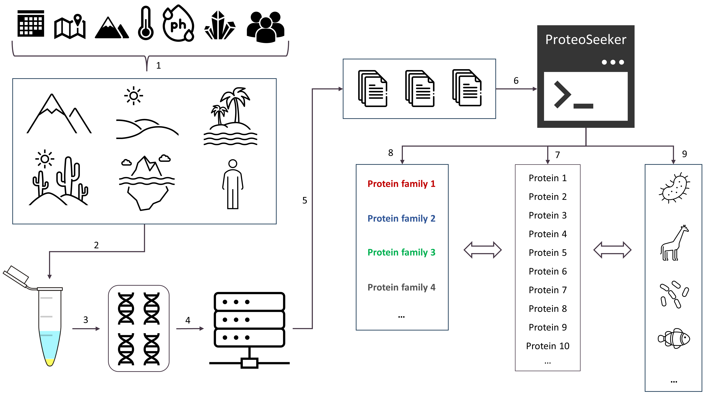

# 1. Overiview
## 1.1 Scope of usage

ProteoSeeker is a feature-rich metagenomic analysis tool which allows for the identification of novel proteins originating from metagenomes. These proteins may be part of specified protein families or/and may be subjected to a taxonomy analysis.

1. **Sampling Site Documentation:** Specific characteristics of the sample's environmental source, including factors such as location, habitat, sampling conditions and collection method are documented.
2. **Sample Collection:** The metagenomic material is collected from the enviromnental nieche of interest.
3. **DNA Isolation and Preparation:** Following DNA extraction, the metagenomic material is preped for sequencing.
4. **Next-Generation Sequencing (NGS):**  NGS is performed to collect the metagenomic dataset of the sample
5. **NGS Data Processing:** The sequencing files (reads) resulting from NGS are generated and data quality control is performed. Datasets and metadata are shared in open-access databases, facilitating collaborative research and data reuse.
   
*Such files can be provided directly to ProteoSeeker for analysis, forming the exploration ground for the tool. Proteoseeker aspires to provide a coprehensive, user-friendly platform for the discovery of novel proteins/enzymes originating from envoronmetns of interest, enriching the scientific community's capacity to explore microbial ecosystems. A user may download such data and provide it to ProteoSeeker or in the case of SRA of NCBI use the code (SRA accession) of the sample from the online database directly to ProteoSeeker.*

6. **ProteoSeeker Analysis:** The selected dataset is uploaded to Proteoseeker. The tool identifies putative proteins derived from the input reads.
7. **Functional Analysis:** Functionalities offered by ProteoSeeker include "seek" and "taxonomy" functionalities, and their respective purposes in protein/enzyme discovery and taxonomic assignment.
8. **Protein Family Profiling:** Protein family profiles from databases like Pfam, groups proteins and facilitates the discovery of novel proteins/enzymes with specific functionalities.
9. **Taxonomic Assignment:** The tool expands on the process of assigning one or more organisms to identified proteins, aiding in the understanding of microbial community composition.

## 1.2 Pipeline

The overall pipeline implemented by ProteoSeeker can be seen in the image below. ProteoSeeker offers two main functionalities with a multitude of options for users not accustomed to metagenomic analysis tools and more advanced users that may want to modify the behaviour of certain tools included in ProteoSeeker's pipeline. The first functionality is to **seek** proteins that may be part of selected protein families and the second funcitonality is to find the **taxonomy** of the proteins discovered from the analysis of a sample. The second functionality is based either on the taxonomy of the reads (kraken2 route) or on binning the contigs and searching for the taxonomy of the proteins through the "taxonomy filtered protein database" (MetaBinner / COMEBin route).

# 2. Installation
## 2.1 Source code

To install ProteoSeeker from source code, conda (from Anaconda or Miniconda) must be installed and activated in your system. Instructions for installing Anaconda and Miniconda in Linux are provided in the following links:

Anaconda for Linux: https://docs.anaconda.com/free/anaconda/install/linux/

Miniconda for Linux: https://docs.anaconda.com/free/miniconda/miniconda-install/

Then download the repository, extract it, move to the installation folder and run the installation script. Follow the steps below:

~~~bash
git clone https://github.com/SkretasLab/ProteoSeeker.git
unzip ProteoSeeker.zip
cd ProteoSeeker/installation
bash instal.sh
~~~

## 2.2 Docker
To install ProteoSeeker from DockerHub as a docker image docker must be installed in your system. To install docker in Linux follow the instructions provided by the link below

Docker engine for Linux: https://docs.docker.com/engine/install/ubuntu/

Then simply download the image from dockerhub:
~~~bash
pull proteoseeker
~~~

### Phobius
For either case of installation process followed in order to use the topology and signal peptide predictions provided by Phobius you must download Phobius from .... If not downloaded ProteoSeeker will run normaly without including topology and signal peptide predictions in its seek functionality.

# 3. Use
## 3.1 Command-line tool
The usage of ProteoSeeker as a command-line tool, its options and default parameters are described below.

~~~bash
ProteoSeeker Version 1.0.0

python enzann.py [options] -i <Input_Folder_Path>

Option description:
1. Parameter type
2. Req: Required, Opt: Optional
3. Default value (shown if not empty or none)
4. Description
Terminology:
spd: seek profile database
tpd: taxonomy profile database
sfpd: seek filtered protein database
tfpd: taxonomy filtered protein database

Options:
---------Input and output options---------
   -i/--input                     Str -Req- The path of the folder with the input files. The
                                  input files can either be single-end or paired-end FASTQ
                                  files but not both.

   -sc/--sra-code                 Str -Opt- A RUN accession code from the SRA database of
                                  NCBI.

   -c/--contigs                   True/False -Opt: False- Indicates whether the files in the
                                  input folder are (non-compressed) files with contigs or
                                  genomes in FASTA format.

   -pi/--protein-input            True/False -Opt: False- Indicates whether the input folder
                                  contains a file with protein sequences in FASTA format.

   -as/--adapters-status          Str -Opt: 'pre'- The following options are available: ide:
                                  Adds the overrepresented sequences identified by FastQC in
                                  the file with the adapters. 'fas': The file with the
                                  adapters will include only the overrepresented sequences
                                  identified by FastQC. 'pre': The  file with the adapters is
                                  used without any modification.

   -a/--adapters                  Str -Req: adapters.fa- Path to the file with the adapters.

   -pdp/--protein-database-path   Str -Opt- Path to the protein database file.

   -kdp/--kraken-database-path    Str -Opt- Path to the kraken database folder.

   -ps/--profiles-seek-path       Str -Opt- Path to the seek profile database with the
                                  profiles associated with one or more protein families.

   -pyp/--profiles-phylo-path     Str -Opt- Path to the phylo profile database with the
                                  profiles associated with one or more protein families.

   -pbp/--profiles-broad-path     Str -Opt- Path to the profile database with the profiles to
                                  be searched in the each protein identified with at least one
                                  profile from the seek profile database.

   -sp/--swissprot-path           Str -Opt- Path to the Swiss-Prot protein database.

   -mp/--motifs-path              Str -Opt- Path to the file with the motifs.

   -o/--output                    Str -Opt- Path to the output folder.

---------Protein family options---------
   -fc/--family-code              Str -Opt- The seek protein family codes.

   -fct/--family-code-taxonomy    Str -Opt- The phylo protein family codes.

   -dn/--database-name            Str -Opt- The seek profile database (spd) and seek filtered
                                  protein database name (sfdp).

   -dnt/--database-name-taxonomy  Str -Opt- The taxonomy profile database (tpd) and taxonomy
                                  filtered protein database name (tfdp).

   -sns/--seek-names-status       True/False -Opt: False- Determines whether the protein names
                                  used to filter the protein database and create the sfpd will
                                  be determined solely based on the protein names provided by
                                  the user (True) or solely based on protein names
                                  automatically identified with or without the addition
                                  protein names provided by the user (False).

   -spn/--seek-protein-names      Str -Opt- Protein names, divided by commas, given as input
                                  from the user and used to filter the seek protein database.
                                  If such protein names are indeed provided and -sns is False,
                                  then these protein names are added to the automatically
                                  identified ones. If such protein names are not provided and
                                  -sns is False, then only the aumatically identified ones are
                                  used for the filtering.

   -tns/--taxonomy-names-status   True/False -Opt: False- Determines whether the protein names
                                  used to filter the protein database and create the tfpd will
                                  be determined solely based on the protein names provided by
                                  the user (True) or solely based on protein names
                                  automatically identified with or without the addition
                                  protein names provided by the user (False).

   -tpn/--taxonomy-protein-names  Str -Opt- Protein names, divided by commas, given as input
                                  from the user and used to filter the taxonomy protein
                                  database. If such protein names are indeed provided and -tns
                                  is False, then these protein names are added to the
                                  automatically identified ones. If such protein names are not
                                  provided and -tns is False, then only the aumatically
                                  identified ones are used for the filtering.

   -nt/--name-threshold           Float -Opt: 0.5- The threshold used to filter the protein
                                  names associated with each protein family. Any protein name
                                  with a frequency below this threshold is omitted.

---------General options: Pipeline---------
   -am/--analysis-mode            Int -Opt: 3- There are three analysis modes. The analysis
                                  mode determines the type of analysis by the seek
                                  functionality. '1': The seek functionality will only search
                                  for proteins to be annotated which include at least one of
                                  the profiles of the spd. '2': The seek functionality will
                                  only search for proteins to be annotated that have at least
                                  one hit against the sfpd with a low enough e-value. '3': The
                                  seek functionality includes both types of analysis '1' and
                                  '2'.

   -p/--paired-end                True/False -Opt: True- Indicates whether the files in the
                                  input folder are paired-end (True) or single-end (False)
                                  files.

   -k/--compressed                True/False -Opt: True- Indicates whether the files in the
                                  input folder are compressed (True) or not (False).

   -fpd/--filter-protein-database True/False -Opt: False- Determines whether the protein
                                  database will be filtered based on protein names to create
                                  the sfpd and tfpd.

   -h/--help                      None -- Displays the help message.

---------General options: FastQC---------
   -sf/--skip-fastqc              True/False -Opt: False- Determines whether the second time
                                  the FastQC analysis is applied, at the preprocessed reads,
                                  will be omitted (True) or not (False).

---------General options: BBDuk---------
   -umr/--bbduk-max-ram           Int -Opt 4: False- The maximum number of GBs of RAM that may
                                  be utilized by BBDuk.

   -cs/--clear-space              True/False -Opt: False- Determines whether the compressed
                                  preprocessed reads (if any) will be deleted (True) before
                                  the assembly or not (False).

---------General options: Megahit---------
   -kl/--k-list                   Str -Opt- A list of k-mers (e.g.,
                                  15,17,21,29,39,59,79,99,119,141) to be used by Megahit.

---------General options: Kraken---------
   -km/--kraken-mode              True/False -Opt: True- Determines whether the taxonomy
                                  functionality will be based on the taxonomy analysis applied
                                  by kraken2 (True) or not (False).

   -kmm/--kraken-memory-mapping   True/False -Opt: True- Determines whether kraken2 will use
                                  memory mapping (True) or not (False). With memory mapping
                                  the analysis performed by kraken2 is slower but is not
                                  limited by the size of the RAM available at the time of the
                                  analysis, rather than by the free memory space of the disk.
                                  Without memory mapping the analysis performed by kraken2 is
                                  faster but is limited by the size of the RAM available at
                                  the time of the analysis.

---------General options: Binning---------
   -bt/--binning-tool             Int -Opt: 1- Determines the binning tool to be used by the
                                  functionality of taxonomy, when kraken2 is set not to be
                                  used (-km False). '1': MetaBinner. '2': COMEBin.

   -bmr/--binning-max-ram         Int -Opt: 4- The maximum number of GBs of RAM that may be
                                  utilized by binning.

   -bc/--bin-contig-len           Int -Opt: 500- The threshold for filtering the contigs based
                                  on their lengths before binning. Any contig with length
                                  below the threshold is omitted from the binning process.

   -bk/--bin-kmer                 Int -Opt: 4- The number of kmers to be used by the binning
                                  tool (MetaBinner or COMEBin).

   -cbs/--comebin-batch-size      Int -Opt: 256- The batch size to be used for the analysis of
                                  COMEBin.

---------General options: CD-HIT---------
   -ct/--cdhit-threshold          Float -Opt: 0.99- The threshold used by CD-HIT. The value
                                  must be a float number between 0 and 1.

   -cmr/--cd-hit-max-ram          Int -Opt: 4000- The maximum number of MBs of RAM that may be
                                  utilized by CD-HIT.

---------General options: Gene prediction---------
   -ge/--gene-encoding            Int -Opt: 1- Determines whether the proteins will be
                                  provided directly from the output of FragGeneScanRs (1) or
                                  will be the output (2) from applying the genetic code
                                  indicated by option -gc to encode the predicted genes from
                                  FragGeneScanRs.

   -gc/--genetic-code             Int -Opt: 11- The genetic code to be used to encode the
                                  genes predicted by FragGeneScanRs to proteins, if such an
                                  action has been selected (-ge 2).

---------General options: HMMER---------
   -st/--score-type               Str -Opt cut_ga- The scoring method used by HMMER. 'cut_ga':
                                  HMMER will use the profile's GA gathering cutoffs to set all
                                  thresholding. 'default': HMMER will use its default scoring
                                  method.

   -sds/--second-domain-search    True/False -Opt: True- Determines whether the screening of
                                  the proteins by hmmscan of HMMER against the Pfam database
                                  will be applied (True) or not (False) during the seek
                                  functionality.

   -ndt/--no-domains-thr          Int -Opt: 70- The negative of this number becomes the power
                                  of 10 and the result is the e-value threshold used to retain
                                  proteins during analysis mode 2 in the seek functionality
                                  for further annotation.

---------General options: Annotation---------
   -at/--add-type                 Str -Opt- A comma-seperated list which includes kinds of
                                  information related to the analysis. The items of the list
                                  are added for each protein in each of the annotation files.

   -ai/--add-info                 Str -Opt- A comma-seperated list which includes values for
                                  the corresponding kinds of information set by -at. The items
                                  of the list are added for each protein in each of the
                                  annotation files.

---------Threads---------
   -t/--threads                   Int -Opt: 4- The maximum number of threads to be used by any
                                  of the processes run by ProteoSeeker.

---------Processes performed after---------
   -afp/--after-peprocessing      True/False -Opt: False- The pipeline start after the
                                  preprocessing of the reads.

   -afa/--after-assembly          True/False -Opt: False- The pipeline starts after the
                                  assembly of the reads. The files generated by the previous
                                  steps should be present in the output folder provided by the
                                  user.

   -afb/--after-binning           True/False -Opt: False- The pipeline starts after binning.
                                  The files generated by the previous steps should be present
                                  in the output folder provided by the user.

   -afg/--after-gene-pred         True/False -Opt: False- The pipeline starts after gene
                                  prediction. The files generated by the previous steps should
                                  be present in the output folder provided by the user.

   -adb/--after-after-db          True/False -Opt: False- The pipeline starts after screening
                                  against the filtered protein database in both cases of the
                                  seek and taxonomy functionalities. The files generated by
                                  the previous steps should be present in the output folder
                                  provided by the user.

   -atp/--after-topology-prediction True/False -Opt: False- The pipeline starts after the
                                  topology prediction in the case of the seek functionality.
                                  The files generated by the previous steps should be present
                                  in the output folder provided by the user.

   -afr/--after-analysis-processes True/False -Opt: False- The pipeline starts after all the
                                  analysis processes and only writes the annotation files for
                                  the proteins, both cases of the seek and taxonomy
                                  functionalities. The files generated by the previous steps
                                  should be present in the output folder provided by the user.

---------Processes performed up to---------
   -utd/--up-to-databases         True/False -Opt: False- The pipeline ends after creating the
                                  seek and taxonomy profile databases and the seek and
                                  taxonomy filtered protein databases are created.

   -utpc/--up-to-preprocessing-com True/False -Opt: False- The pipeline ends after the
                                  preprocessing of the reads.

   -utpu/--up-to-preprocessing-uncom True/False -Opt: False- The pipeline ends after
                                  decompressing the compressed preprocessed reads.

   -uta/--up-to-assembly          True/False -Opt: False- The pipeline ends after the assembly
                                  of the reads.

---------Tool enviroments---------
   -sen/--sra-env                 Str -Opt: ps_sra_tools- The conda enviroment for sra tools.
                                  'None/none': To not use an enviroment at all.

   -fen/--fastqc-env              Str -Opt: ps_fastqc- The conda enviroment for FastQC.
                                  'None/none': To not use an enviroment at all.

   -uen/--bbtools-env             Str -Opt: ps_bbtools- The conda enviroment for bbtools.
                                  'None/none': To not use an enviroment at all.

   -men/--megahit-env             Str -Opt: ps_megahit- The conda enviroment for megahit.
                                  'None/none': To not use an enviroment at all.

   -ken/--kraken-env              Str -Opt: ps_kraken- The conda enviroment for kraken2.
                                  'None/none': To not use an enviroment at all.

   -nen/--metabinner-env          Str -Opt: ps_metabinner- The conda enviroment for
                                  MetaBinner. 'None/none': To not use an enviroment at all.

   -sen/--comebin-env             Str -Opt: ps_comebin- The conda enviroment for sra tools.
                                  'None/none': To not use an enviroment at all.

   -ien/--cdhit-env               Str -Opt: ps_cd_hit- The conda enviroment for CD-HIT.
                                  'None/none': To not use an enviroment at all.

   -gen/--genepred-env            Str -Opt- The conda enviroment for FragGeneScanRs.
                                  'None/none': To not use an enviroment at all.

   -hen/--hmmer-env               Str -Opt: ps_hmmer- The conda enviroment for HMMER.
                                  'None/none': To not use an enviroment at all.

   -den/--dimaond-env             Str -Opt: ps_diamond- The conda enviroment for DIMAOND
                                  BLASTP. 'None/none': To not use an enviroment at all.

   -ten/--taxonkit-env            Str -Opt: ps_taxonkit- The conda enviroment for taxonkit.
                                  'None/none': To not use an enviroment at all.

   -pen/--phobius-env             Str -Opt: ps_phobius- The conda enviroment for Phobius.
                                  'None/none': To not use an enviroment at all.

   -ben/--bowtie-env              Str -Opt: ps_bowtie- The conda enviroment for Bowtie2.
                                  'None/none': To not use an enviroment at all.

---------Tool paths---------
   -abp/--anaconda-bin-path       Str -Opt- The path to the anaconda bin folder.

   -rfp/--prefetch-path           Str -Opt- The path to the prefetch executable.

   -vvp/--vdb_validate-path       Str -Opt- The path to the vdb-validate executable.

   -fdp/--fastq-dump-path         Str -Opt- The path to the fastq-dump executable.

   -fp/--fastqc-path              Str -Opt- The path to the fastqc executable.

   -gzp/--gzip-path               Str -Opt- The path to the gzip executable.

   -ctp/--cat-path                Str -Opt- The path to the cat executable.

   -bdp/--bbduk-path              Str -Opt- The path to the bbduk executable.

   -mp/--megahit-path             Str -Opt- The path to the megahit executable.

   -kp/--kraken-path              Str -Opt- The path to the kraken executable.

   -bfp/--binner-folder-path      Str -Opt- The path to the bin folder of MetaBiner.

   -cfp/--comebin-folder-path     Str -Opt- The path to the bin folder of COMEBin.

   -chp/--cd-hit-path             Str -Opt- The path to the CD-HIT executable.

   -fgp/--fraggenescars-path      Str -Opt- The path to the FragGeneScanRs executable.

   -hp/--hmmscan-path             Str -Opt- The path to the hmmscan executable.

   -hpp/--hmmpress-path           Str -Opt- The path to the hmmpress executable.

   -hfp/--hmmfetch-path           Str -Opt- The path to the hmmfetch executable.

   -dp/--diamond-path             Str -Opt- The path to the diamond executable.

   -tkp/--taxonkit-path           Str -Opt- The path to the taxonkit executable.

   -php/--phobius-folder-path     Str -Opt- The path to the folder of phobius.

   -bbp/--bowtie-build-path       Str -Opt- The path to the bowtie build executable.

   -hfp/--bowtie-path             Str -Opt- The path to the bowtie executable.

   -pfp/--parameters-file-path    Str -Opt- The path to the file with the parameters and their
                                  values.
~~~

## 3.2 Docker image

ProteoSeeker is already installed, alongside with all its databases in its proteoseeker image. For someone to run ProteoSeeker in its image he should at first start the image in interactive mode. To inform ProteoSeeker to use a local installation of Phobius, the folder to the Phobius should be mounted at first to the docker image and then the path to the phobius folder be provided as a parameter to ProteoSeeker. In the docker image ProteoSeeker can be used as a command-line tool.

