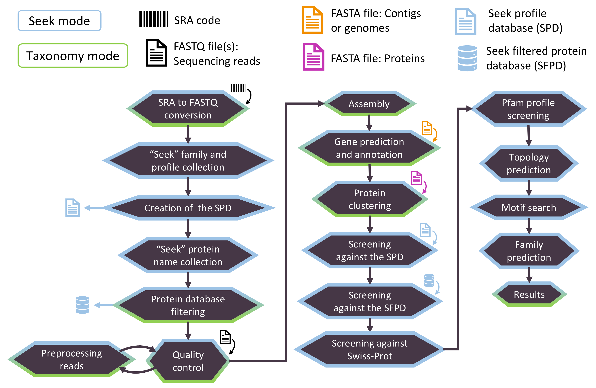
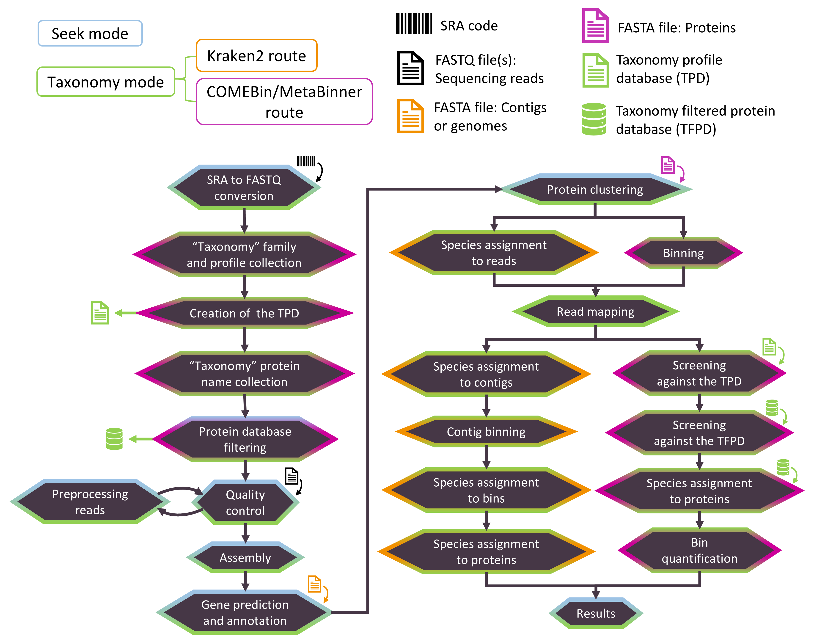

# 1. Overview
## 1.1 Field of utilization

ProteoSeeker is a feature-rich metagenomic analysis tool for accessible and comprehensive metagenomic exploration. It allows for the identification of novel proteins originating from metagenomes. These proteins may be part of specified protein families or/and may be subjected to a taxonomy analysis.

1. 
<strong>Sampling Site Documentation:</strong> Specific characteristics of the sample's environmental source, including factors such as location, habitat, sampling conditions and collection method are documented.

2. 
<strong>Sample Collection:</strong> The metagenomic material is collected from the environmental niche of interest.

3. 
<strong>DNA Isolation and Preparation:</strong> Following DNA extraction, the metagenomic material is prepped for sequencing.

4. 
<strong>Next-Generation Sequencing (NGS):</strong> NGS is performed to collect the dataset(s) with the reads originating from the sample.

5. 
<strong>NGS Data Processing:</strong> Datasets and metadata are shared in open-access databases, facilitating collaborative research and data reuse. Such files can be provided directly to ProteoSeeker for analysis, forming the exploration ground for the tool. A user may download such datasets and use them as input to ProteoSeeker, or in the case of the SRA database of NCBI provide the SRA accession of a sample directly as input to ProteoSeeker. For exaple, Proteoseeker may be utilized for the discovery of novel proteins/enzymes originating from environments of interest, enriching the scientific community's capacity to explore microbial ecosystems.

6. 
<strong>ProteoSeeker Analysis:</strong> The selected dataset(s) or SRA accession is/are provided to Proteoseeker. The tool identifies putative proteins derived from the reads.

7. 
<strong>Functional Analysis:</strong> ProteoSeeker offers two functionalities applied through its "seek" and "taxonomy" modes, purposed in discovering proteins/enzymes from specific protein families and performing taxonomic assignment of the proteins respectively.

8. 
<strong>Protein Family Profiling:</strong> Protein family profile Hidden Markov Models (pHMMs) from the Pfam database form the basis for the discovery of novel proteins/enzymes from specific protein families, thus with specific functionalities.

9. 
<strong>Taxonomic Assignment:</strong> The tool expands on the process of assigning one or more taxa to identified proteins, aiding in the understanding of microbial community composition.

## 1.2 Pipeline

The pipeline implemented by ProteoSeeker in the "seek" and "taxonomy" modes can be seen in the images below. ProteoSeeker offers two main functionalities with a multitude of options for users not accustomed to metagenomic analysis tools and more advanced users that may want to modify the behaviour of certain tools included in ProteoSeeker's pipeline. The first functionality is to seek proteins that may be part of selected protein families and the second functionality is to find the "taxonomy" of the proteins discovered from the analysis of a sample. The seek mode offers 3 types of analysis, "type 1, 2 and 3". The taxonomy mode is applied either by the "Kraken2 route" which is based on the taxonomy classification of the reads by Kraken2 or the "COMEBin/MetaBinner route" which is based on binning the contigs through COMEBin or MetaBinner and searching for the taxonomy of the proteins, through the "taxonomy filtered protein database".

### 1.2.1 Seek mode

The stages of the seek mode of ProteoSeeker. ProteoSeeker offers two main functionalities applied through the seek mode (blue) and the taxonomy mode (green). Each stage is colored based on the mode it belongs to. The possible types of input for ProteoSeeker include an SRA code, reads in FASTQ files, contigs or genomes or proteins in FASTA format. If an SRA code is provided, the corresponding SRA file and FASTQ file(s) are generated.

1. The selected protein families are determined based on their input codes. Type **1, 2, 3** analysis.
2. The profiles and protein names associated with the selected families are collected and the spd is created. Type **1, 2, 3** analysis.
3. The protein database is filtered based on the collected protein names and the sfpd is created. Type **2, 3** analysis.
4. The reads of the FASTQ files undergo several quality control checks by FastQC. Type **1, 2, 3** analysis.
5. The reads are preprocessed by BBDuk and then are analyzed by FastQC for a second time. Type **1, 2, 3** analysis.
6. The preprocessed reads are assembled into contigs by Megahit. Type **1, 2, 3** analysis.
7. Protein coding regions (pcdrs) are predicted in the contigs by FragGeneScanRs. Type **1, 2, 3** analysis.
8. CD-HIT is used to reduce the redundancy of the pcdrs. Type **1, 2, 3** analysis.
9. The pcdrs are screened against the spd through HMMER. Any pcdr with at least one hit based on the latter screening is retained (set 1). Type **1, 2, 3** analysis.
10. The rest of the pcdrs are screened against the sfpd through DIAMOND BLASTP and only those with at least one hit with an e-value lower than the threshold are retained (set 2). In addition, set 1, if not empty, is screened against the Swiss-Prot protein database through DIAMOND BLASTP. Type **2, 3** analysis.
11. Both sets are screened against all the profiles of the Pfam database through HMMER. Type **1, 2, 3** analysis.
12. Topology prediction is performed by Phobius. Type **1, 2, 3** analysis.
13. Motifs provided by the  are screened against each protein. Type **1, 2, 3** analysis.
14. The protein family of each protein is predicted. Type **1, 2, 3** analysis.
15. Annotation files are written. Type **1, 2, 3** analysis.

### 1.2.2 Taxonomy mode

The stages of the taxonomy mode of ProteoSeeker. ProteoSeeker offers two main functionalities applied through the seek mode (blue) and the taxonomy mode (green). The taxonomic analysis can be performed by either of two routes. The first one is based on Kraken2 (orange) and the second one is based on COMEBin or MetaBinner (purple). Each stage is colored based on the mode and taxonomy route it belongs to. The possible types of input for ProteoSeeker include an SRA code, reads in FASTQ files, contigs or genomes or proteins in FASTA format. If an SRA code is provided, the corresponding SRA file and FASTQ file(s) are generated.

1. The selected protein families are determined based on their input codes.
2. The profiles and protein names associated with the selected families are collected and the tpd is created.
3. The protein database is filtered based on the collected protein names and the tfpd is created.
4. The reads of the FASTQ files undergo several quality control checks by FastQC.
5. The reads are preprocessed by BBDuk and then are analyzed by FastQC for a second time.
6. The preprocessed reads are assembled into contigs by Megahit.
7. Protein coding regions (pcdrs) are predicted in the contigs by FragGeneScanRs.
8. CD-HIT is used to reduce the redundancy of the pcdrs.
9. Bowtie2 maps the reads to the contigs.
10. The contigs are binned based on MetaBinner or COMEBin.
11. The pcdrs are screened against the tpd through HMMER.
12. Any pcdr with at least one hit against the tpd is screened against the tfpd through DIAMOND BLASTP.
13. Taxa are assigned to the proteins based on the assignment of taxa to the bins.
14. Each bin, along with any taxa assigned to it, is quantified based on the reads mapped to its contigs.
15. Annotation files are written.
16. Species are assigned to the reads based on Kraken2.
17. Through the read-contig mapping, each species is quantified for each contig. Species are assigned to the contigs.
18. The contigs are binned based on their species.
19. Species are assigned to the bins.
20. Species are assigned to the proteins of the bins.
21. Annotation files are written.

# 2. Installation

It is proposed to run ProteoSeeker in a Docker container through its image than directly through the command-line, when that is possible. Therefore, it is proposed to install Docker and download the Docker image of ProteoSeeker. Running ProteoSeeker through the command-line would be necessary to perform the tests described in the evaluation section and when the same SRA sample is to be analyzed multiple times in which case running ProteoSeeker directly through the command-line would retain the SRA file after it is downloaded and processed and there would be no need to download and process it again in future runs.

## 2.1 Docker

To install ProteoSeeker from Docker Hub as a Docker image, Docker must be installed in your system. To install Docker in Ubuntu, follow the instructions provided by the link below:

Docker engine for Ubuntu: https://docs.docker.com/engine/install/ubuntu/

Then, download the image of ProteoSeeker from Docker Hub. There are two versions. The "main_v1.0.0" version contains the "Kraken 2/Bracken Refseq indexes Collection Standard-8 database" while the "light_v1.0.0" version does not. Hence, the main_v1.0.0 version can be used directly to run the seek or the taxonomy mode of ProteoSeeker, specifically through the Kraken2 route. The light_v1.0.0 version can be used directly to run only the seek mode of ProteoSeeker. Neither version contains a protein database. The process of using a protein database through Docker is described below. Both versions can be modified to utilize a protein database and thus be used to run the seek mode type 2 or 3 analysis and the taxonomy mode through the COMEBin/MetaBinner route of ProteoSeeker.

The main_v1.0.0 version has a download size of  **12.92 GB** and decompressed has a size of **29.9 GB**. To install the main_v1.0.0 version use **one** of the following commands:
~~~bash
sudo docker image pull skretaslab/proteoseeker
or
sudo docker image pull skretaslab/proteoseeker:latest
or
sudo docker image pull skretaslab/proteoseeker:main_v1.0.0
~~~

The light_v1.0.0 version has a download size of  **7.42 GB** and decompressed has a size of **21.8 GB**. To install the light_v1.0.0 version use the following command:
~~~bash
sudo docker image pull skretaslab/proteoseeker:light_v1.0.0
~~~

## 2.2 Source code
### 2.2.1 Prerequisites
#### Anaconda:

To install ProteoSeeker from source code, conda, from Anaconda, must be installed and activated in your system. Instructions for the installation of Anaconda in Linux are provided in the following link:

Anaconda for Linux: https://docs.anaconda.com/free/anaconda/install/linux/

#### git:

Necessary to download the ProteoSeeker repository.

### 2.2.2 Dependencies

All dependencies, except for the protein database, are automatically installed by the installation process of ProteoSeeker. You can skip this part if you want to go straight to the installation instructions but do read the information related to the protein database (at section "2.2.3") which is not installed automatically.

#### git, wget, gzip, tar:

These packages are handled by the installation process of ProteoSeeker and are installed in an environment from which the installation of ProteoSeeker will be initiated. A new environment called "ps_install" is created, used to download and collect the required packages. If one wants to use a custom conda environment for the installation of ProteoSeeker, it should contain the following:

   
~~~bash
conda install anaconda::git
conda install anaconda::wget
conda install conda-forge::gzip
conda install conda-forge::tar
~~~

In addition, the name of the custom environment must replace the name of the environment ("ps_install") in line 14 ("conda activate ps_install") in the file "install.sh". It is suggested not to perform these changes if possible and let the installation process handle the creation and usage of the installation environment for these packages.

#### Pipeline tools

These tools are all automatically installed by the installation process of ProteoSeeker or have already been set in the Docker image of ProteoSeeker. The specific versions of the tools included in the ProteoSeeker's installation are the ones also used for the evaluation of the "seek" and "taxonomy" modes of ProteoSeeker. For some packages more than one installation method is provided. If the first method is not successful then the next one is attempted. The versions of conda and of these tools are the following:

1. conda 24.1.2
2. bbmap: 39.01
3. bowtie2: 2.5.3
4. cd-hit: 4.8.1
5. comebin:
   1. Conda: 1.0.4 - Used for the evaluation.
   2. Source: Branch: "1.0.4".
8. diamond: 2.1.9
9. fastqc 0.12.1
10. hmmer: 3.4
11. kraken2:
    1. Conda: 2.1.3 - Used for the evaluation.
    2. Source: Branch: "v2.1.3"
13. megahit: 1.2.9
14. metabinner:
    1. Source: Branch: "master", Hash: "50a1281e8200d705a744736f23efe53c6048bbe8" - Used for the evaluation.
    2. Conda: 1.4.4
16. sra-tools: 3.1.0
17. taxonkit: 0.16.0
18. csvtk: 0.30.0
19. FragGeneScanRs: 1.1.0

### 2.2.3 Databases

The latest versions of the following databases are installed automatically by ProteoSeeker. To see the datetime of their collection for the evaluation of ProteoSeeker, check the evaluation section, "4". Only the protein database should be installed by you, in which case, you can use the Bash script "nr_install.sh" for installing the nr database. The latter file is located in the "installation" directory. You should be certain that the system has enough available memory space to hold the decompressed nr database which is approximately <strong>400 GB</strong>.

1. Pfam database: Latest - Automatic installation
2. Swiss-Prot/UniprotKB database: Latest - Automatic installation
3. GTDB taxonomy taxdump files: Latest - Automatic installation
4. Kraken 2/Bracken Refseq indexes: Collection Standard-8: Latest - Automatic installation
5. nr database: Latest - Automatic installation

### 2.2.4 Installation

Follow the steps below to perform the following installation steps. Open a terminal in the desired directory, download the repository (or download the ZIP file of the repository and extract it in the desired installation directory) and move in the main ProteoSeeker directory. Give the proper permissions to the files of the installation directory. Add, if not present, and move to the top the conda channels of "conda-forge" and "bioconda" and set the channel priority of conda to "flexible". Then, run the installation script. The installation requires approximately 30-40 minutes to be completed.

~~~bash
git clone https://github.com/SkretasLab/ProteoSeeker.git
cd ProteoSeeker_main
sudo chmod -R 755 installation
cd installation
conda config --add channels conda-forge
conda config --add channels bioconda
conda config --set channel_priority flexible
./install.sh
~~~

### 2.2.5 Parameter files

You can create a set of "template" parameter files which can be used to run the seek or the taxonomy mode or both modes of ProteoSeeker by running the following script in the installation directory from the same directory. This set of files is generated in the main directory of ProteoSeeker.

~~~bash
./parameter_files.sh
~~~

### 2.2.6 COMEBin - GPU

It should be noted that COMEBin can also be installed and run on a GPU. Instructions are available at: https://github.com/ziyewang/COMEBin and also below:

~~~bash
conda create -n ps_comebin_gpu
conda activate ps_comebin_gpu
conda install -c conda-forge -c bioconda comebin
conda install pytorch pytorch-cuda=11.8 -c pytorch -c nvidia -c conda-forge
conda deactivate
~~~

We have observed that running COMEBin with a GPU offers a great improvement in the running time of COMEBin. To use COMEBin in an environment which allows the usage of a GPU, provide that environments's name to the default name of the environment for COMEBin and also modify the path to the COMEBin directory of the environment. These paths refer to the following options of ProteoSeeker:

~~~bash
   -sen/--comebin-env             Str -Opt: ps_comebin- The conda environment for sra tools.
                                  'None/none': To not use an environment at all.

   -cfp/--comebin-folder-path     Str -Opt- The path to the bin folder of COMEBin.
~~~

For example, the second option in our system has the following value: "/home/compteam/anaconda3/envs/ps_comebin_gpu/bin/COMEBin"

### 2.2.7 Removing installation environments, files and directories

To remove the environments, all their files and the directories which environments and directories were created during the installation of ProteoSeeker (by running the "./install.sh" script), run the script below, in the installation directory from the installation directory. You can then delete the main directory of ProteoSeeker and all environments and files associated with installing ProteoSeeker will have been removed by your system.

~~~bash
./remove.sh
~~~

### Phobius

For either case of installation process, in order to use the topology and signal peptide predictions provided by Phobius you must download Phobius from https://phobius.sbc.su.se/data.html. As described in section "3.4" to utilize Phobius when running ProteoSeeker through the command-line you should also provide the path to the Phobius directory in the parameter file or as a parameter through the corresponding option of "proteoseeker.py". The default path for the Phobius installation in a Docker container from the proteoseeker Docker image is already set to the phobius directory of the shared directory and you should download and copy the Phobius installation files in that directory as explained in section "3.3" below. In any other case, ProteoSeeker will run without performing topology and signal peptide predictions in its seek functionality.

# 3. Use

It is proposed to run ProteoSeeker in a Docker container through its image than directly through the command-line, when that is possible. Running ProteoSeeker through the command-line would be necessary to perform the tests described in the evaluation section and when the same SRA sample is to be analyzed multiple times in which case running ProteoSeeker directly through the command-line would retain the SRA file after it is downloaded and processed and there would be no need to download and process it again in future runs.

## 3.1 Parameter file

In general, the easiest way to run ProteoSeeker is to use a parameter file. A parameter file should, at least, contain the parameters for the options of ProteoSeeker which are to be modified from their default values. Parameter files for different case-scenarios are offered by the installation of ProteoSeeker for utilizing it in a Docker container or directly through the command-line. The "template" parameter files contain all options. A parameter file is the proposed way of using ProteoSeeker. In addition, we advise that the paths used as input to ProteoSeeker (for files or databases) contain no whitespaces and are absolute paths instead of relative paths, although ProteoSeeker is designed to handle each of these cases.

## 3.2 Options

The options of ProteoSeeker as a command-line tool, their default values and their descriptions are presented below.

~~~bash
ProteoSeeker Version 1.0.0

Usage:
python proteoseeker.py -pfp <parameters_file_path> [other_options]
or
python proteoseeker.py [options]

Option description:
1. Parameter type
2. Req: Required, Opt: Optional
3. Default value (shown if not empty or none)
4. Description

Terminology:
spd: seek profile database
tpd: taxonomy profile database
sfpd: seek filtered protein database
tfpd: taxonomy filtered protein database

Options:
---------Input and output options---------
   -i/--input                     Str -Req- The path of the folder with the input files. The
                                  input files can either be single-end or paired-end FASTQ
                                  files but not both.

   -sc/--sra-code                 Str -Opt- A RUN accession code from the SRA database of
                                  NCBI.

   -c/--contigs                   True/False -Opt: False- Indicates whether the files in the
                                  input folder are (non-compressed) files with contigs or
                                  genomes in FASTA format.

   -pi/--protein-input            True/False -Opt: False- Indicates whether the input folder
                                  contains a file with protein sequences in FASTA format.

   -a/--adapters                  Str -Req: adapters.fa- Path to the file with the adapters.

   -pdp/--protein-database-path   Str -Opt- Path to the protein database file.

   -kdp/--kraken-database-path    Str -Opt- Path to the kraken database folder.

   -psp/--profiles-seek-path      Str -Opt- Path to the seek profile database with the
                                  profiles associated with one or more protein families.

   -pyp/--profiles-phylo-path     Str -Opt- Path to the phylo profile database with the
                                  profiles associated with one or more protein families.

   -pbp/--profiles-broad-path     Str -Opt- Path to the profile database with the profiles to
                                  be searched in the each protein identified with at least one
                                  profile from the seek profile database.

   -sp/--swissprot-path           Str -Opt- Path to the Swiss-Prot protein database.

   -mp/--motifs-path              Str -Opt- Path to the file with the motifs.

   -pfp/--parameters-file-path    Str -Opt- The path to the file with the parameters and their
                                  values.

   -o/--output                    Str -Opt- Path to the output folder.

---------Protein family options---------
   -fc/--family-code              Str -Opt- The seek protein family codes.

   -fct/--family-code-taxonomy    Str -Opt- The phylo protein family codes.

   -dn/--database-name            Str -Opt- The seek profile database (spd) and seek filtered
                                  protein database name (sfdp).

   -dnt/--database-name-taxonomy  Str -Opt- The taxonomy profile database (tpd) and taxonomy
                                  filtered protein database name (tfdp).

   -sns/--seek-names-status       True/False -Opt: False- Determines whether the protein names
                                  used to filter the protein database and create the sfpd will
                                  be determined solely based on the protein names provided by
                                  the user (True) or solely based on protein names
                                  automatically identified with or without the addition
                                  protein names provided by the user (False).

   -spn/--seek-protein-names      Str -Opt- Protein names, divided by commas, given as input
                                  from the user and used to filter the seek protein database.
                                  If such protein names are indeed provided and -sns is False,
                                  then these protein names are added to the automatically
                                  identified ones. If such protein names are not provided and
                                  -sns is False, then only the aumatically identified ones are
                                  used for the filtering.

   -tns/--taxonomy-names-status   True/False -Opt: False- Determines whether the protein names
                                  used to filter the protein database and create the tfpd will
                                  be determined solely based on the protein names provided by
                                  the user (True) or solely based on protein names
                                  automatically identified with or without the addition
                                  protein names provided by the user (False).

   -tpn/--taxonomy-protein-names  Str -Opt- Protein names, divided by commas, given as input
                                  from the user and used to filter the taxonomy protein
                                  database. If such protein names are indeed provided and -tns
                                  is False, then these protein names are added to the
                                  automatically identified ones. If such protein names are not
                                  provided and -tns is False, then only the aumatically
                                  identified ones are used for the filtering.

   -nt/--name-threshold           Float -Opt: 0.5- The threshold used to filter the protein
                                  names associated with each protein family. Any protein name
                                  with a frequency below this threshold is omitted.

---------General options: Pipeline---------
   -sr/--seek-route               Int -Opt: 3- There are three analysis modes. The analysis
                                  mode determines the type of analysis by the seek
                                  functionality. '1': The seek functionality will only search
                                  for proteins to be annotated which include at least one of
                                  the profiles of the spd. '2': The seek functionality will
                                  only search for proteins to be annotated that have at least
                                  one hit against the sfpd with a low enough e-value. '3': The
                                  seek functionality includes both types of analysis '1' and
                                  '2'.

   -p/--paired-end                True/False -Opt: True- Indicates whether the files in the
                                  input folder are paired-end (True) or single-end (False)
                                  files.

   -k/--compressed                True/False -Opt: True- Indicates whether the files in the
                                  input folder are compressed (True) or not (False).

   -fpd/--filter-protein-database True/False -Opt: False- Determines whether the protein
                                  database will be filtered based on protein names to create
                                  the sfpd and tfpd.

   -ps/--preftech-size            Int -Opt: 20- The maximum file size to download in KB (K for
                                  kilobytes, M for megabytes, G gigabytes).

   -as/--adapters-status          Str -Opt: 'pre'- The following options are available: ide:
                                  Adds the overrepresented sequences identified by FastQC in
                                  the file with the adapters. 'fas': The file with the
                                  adapters will include only the overrepresented sequences
                                  identified by FastQC. 'pre': The  file with the adapters is
                                  used without any modification.

   -asi/--add-seek-info           True/False -Opt: True- Determines whether the results in the
                                  TXT and the EXCEL file will only contain information for the
                                  proteins identified through the seek mode (True) or not
                                  (False). In case only the taxonomy mode is applied, this
                                  option has no effect on the results.

   -ati/--add-taxonomy-info       True/False -Opt: True- Determines whether the results in the
                                  TXT and the EXCEL file will only contain information for the
                                  proteins characterized through the taxonomy mode (True) or
                                  not (False). The latter proteins are the ones encoded by
                                  genes which are part of contigs that are grouped in bins,
                                  which bins have also been associated with at least one
                                  species. In case only the seek mode is applied, this option
                                  has no effect on the results.

   -h/--help                      None -- Displays the help message.

---------General options: FastQC---------
   -sf/--skip-fastqc              True/False -Opt: False- Determines whether the second time
                                  the FastQC analysis is applied, at the preprocessed reads,
                                  will be omitted (True) or not (False).

---------General options: BBDuk---------
   -umr/--bbduk-max-ram           Int -Opt 4: False- The maximum number of GBs of RAM that may
                                  be utilized by BBDuk.

   -cs/--clear-space              True/False -Opt: False- Determines whether the compressed
                                  preprocessed reads (if any) will be deleted (True) before
                                  the assembly or not (False).

---------General options: Megahit---------
   -kl/--k-list                   Str -Opt- A list of k-mers (e.g.,
                                  15,17,21,29,39,59,79,99,119,141) to be used by Megahit.

---------General options: Kraken---------
   -km/--kraken-mode              True/False -Opt: True- Determines whether the taxonomy
                                  functionality will be based on the taxonomy analysis applied
                                  by kraken2 (True) or not (False).

   -kt/--kraken-threshold         Int/Float -Opt -1: False- A list with read-filtering
                                  threshold for the species reported by kraken. The list
                                  should include integers of floats separated by commads. An
                                  integer is used as an absolute read threshold and a float is
                                  used as a percentage threshold applied to the percentagies
                                  reported by kraken for each species (e.g., 100 to represent
                                  a threshold of 100 reads, 1 to represent a threshold of 1
                                  read, 1.0 to represent a threshold of 1%, 12.5 to represent
                                  a threshold of 12.5%). In addition, the values of -1 or -2
                                  can be provided, to automatically set the threshold. For the
                                  value of -1 the threshold is set specifically for non-gut
                                  metagenomes and for the value of -2 the threshold is set
                                  specifically for gut metagenomes. When kraken is selected a
                                  binning process takes place based on the filtered species
                                  from the results of kraken. The latter binning process is
                                  based on the filtering performed based on the first
                                  threshold value of the list (if not only one).

   -kmm/--kraken-memory-mapping   True/False -Opt: True- Determines whether kraken2 will use
                                  memory mapping (True) or not (False). With memory mapping
                                  the analysis performed by kraken2 is slower but is not
                                  limited by the size of the RAM available at the time of the
                                  analysis, rather than by the free memory space of the disk.
                                  Without memory mapping the analysis performed by kraken2 is
                                  faster but is limited by the size of the RAM available at
                                  the time of the analysis.

---------General options: Binning---------
   -bt/--binning-tool             Int -Opt: 1- Determines the binning tool to be used by the
                                  functionality of taxonomy, when kraken2 is set not to be
                                  used (-km False). '1': MetaBinner. '2': COMEBin.

   -bmr/--binning-max-ram         Int -Opt: 4- The maximum number of GBs of RAM that may be
                                  utilized by binning.

   -bc/--bin-contig-len           Int -Opt: 500- The threshold for filtering the contigs based
                                  on their lengths before binning. Any contig with length
                                  below the threshold is omitted from the binning process.

   -bk/--bin-kmer                 Int -Opt: 4- The number of kmers to be used by the binning
                                  tool (MetaBinner or COMEBin).

   -cbs/--comebin-batch-size      Int -Opt: 256- The batch size to be used for the analysis of
                                  COMEBin.

---------General options: CD-HIT---------
   -ct/--cdhit-threshold          Float -Opt: 0.99- The threshold used by CD-HIT. The value
                                  must be a float number between 0 and 1.

   -cmr/--cd-hit-max-ram          Int -Opt: 4000- The maximum number of MBs of RAM that may be
                                  utilized by CD-HIT.

---------General options: Gene prediction---------
   -ge/--gene-encoding            Int -Opt: 1- Determines whether the proteins will be
                                  provided directly from the output of FragGeneScanRs (1) or
                                  will be the output (2) from applying the genetic code
                                  indicated by option -gc to encode the predicted genes from
                                  FragGeneScanRs.

   -gc/--genetic-code             Int -Opt: 11- The genetic code to be used to encode the
                                  genes predicted by FragGeneScanRs to proteins, if such an
                                  action has been selected (-ge 2).

---------General options: HMMER---------
   -st/--score-type               Str -Opt cut_ga- The scoring method used by HMMER. 'cut_ga':
                                  HMMER will use the GA gathering cutoffs of the profile to set all
                                  thresholding. 'default': HMMER will use its default scoring
                                  method.

   -sds/--second-domain-search    True/False -Opt: True- Determines whether the screening of
                                  the proteins by hmmscan of HMMER against the Pfam database
                                  will be applied (True) or not (False) during the seek
                                  functionality.

   -ndt/--no-domains-thr          Int -Opt: 70- The negative of this number becomes the power
                                  of 10 and the result is the e-value threshold used to retain
                                  proteins during analysis mode 2 in the seek functionality
                                  for further annotation.

---------General options: Annotation---------
   -at/--add-type                 Str -Opt- A comma-separated list which includes kinds of
                                  information related to the analysis. The items of the list
                                  are added for each protein in each of the annotation files.

   -ai/--add-info                 Str -Opt- A comma-separated list which includes values for
                                  the corresponding kinds of information set by -at. The items
                                  of the list are added for each protein in each of the
                                  annotation files.

---------Threads---------
   -t/--threads                   Int -Opt: 4- The maximum number of threads to be used by any
                                  of the processes used by ProteoSeeker.

   -ft/--filtering-threads        Int -Opt: -t- The maximum number of threads to be used by
                                  the filtering process of the protein database by
                                  ProteoSeeker. If not modified, the default value is equal to
                                  the value given at -t. Otherwise, it overwrites the value of
                                  -t.

---------Processes performed after---------
   -afp/--after-peprocessing      True/False -Opt: False- The pipeline start after the
                                  preprocessing of the reads.

   -afa/--after-assembly          True/False -Opt: False- The pipeline starts after the
                                  assembly of the reads. The files generated by the previous
                                  steps should be present in the output folder provided by the
                                  user.

   -afg/--after-gene-pred         True/False -Opt: False- The pipeline starts after gene
                                  prediction. The files generated by the previous steps should
                                  be present in the output folder provided by the user.

   -afb/--after-binning           True/False -Opt: False- The pipeline starts after binning.
                                  The files generated by the previous steps should be present
                                  in the output folder provided by the user.

   -adb/--after-after-db          True/False -Opt: False- The pipeline starts after screening
                                  against the filtered protein database in both cases of the
                                  seek and taxonomy functionalities. The files generated by
                                  the previous steps should be present in the output folder
                                  provided by the user.

   -atp/--after-topology-prediction True/False -Opt: False- The pipeline starts after the
                                  topology prediction in the case of the seek functionality.
                                  The files generated by the previous steps should be present
                                  in the output folder provided by the user.

   -afr/--after-analysis-processes True/False -Opt: False- The pipeline starts after all the
                                  analysis processes and only writes the annotation files for
                                  the proteins, both cases of the seek and taxonomy
                                  functionalities. The files generated by the previous steps
                                  should be present in the output folder provided by the user.

---------Processes performed up to---------
   -uts/--up-to-sra               True/False -Opt: False- The pipeline ends after downloading
                                  and processing the sample corresponding to the SRA code.

   -utd/--up-to-databases         True/False -Opt: False- The pipeline ends after creating the
                                  seek and taxonomy profile databases and the seek and
                                  taxonomy filtered protein databases are created.

   -utpc/--up-to-preprocessing-com True/False -Opt: False- The pipeline ends after the
                                  preprocessing of the reads.

   -utpu/--up-to-preprocessing-uncom True/False -Opt: False- The pipeline ends after
                                  decompressing the compressed preprocessed reads.

   -uta/--up-to-assembly          True/False -Opt: False- The pipeline ends after the assembly
                                  of the reads.

---------Tool environments---------
   -sen/--sra-env                 Str -Opt: ps_sra_tools- The conda environment for sra tools.
                                  'None/none': To not use an environment at all.

   -fen/--fastqc-env              Str -Opt: ps_fastqc- The conda environment for FastQC.
                                  'None/none': To not use an environment at all.

   -uen/--bbtools-env             Str -Opt: ps_bbtools- The conda environment for bbtools.
                                  'None/none': To not use an environment at all.

   -men/--megahit-env             Str -Opt: ps_megahit- The conda environment for megahit.
                                  'None/none': To not use an environment at all.

   -ken/--kraken-env              Str -Opt: ps_kraken- The conda environment for kraken2.
                                  'None/none': To not use an environment at all.

   -nen/--metabinner-env          Str -Opt: ps_metabinner- The conda environment for
                                  MetaBinner. 'None/none': To not use an environment at all.

   -sen/--comebin-env             Str -Opt: ps_comebin- The conda environment for sra tools.
                                  'None/none': To not use an environment at all.

   -ien/--cdhit-env               Str -Opt: ps_cd_hit- The conda environment for CD-HIT.
                                  'None/none': To not use an environment at all.

   -gen/--genepred-env            Str -Opt- The conda environment for FragGeneScanRs.
                                  'None/none': To not use an environment at all.

   -hen/--hmmer-env               Str -Opt: ps_hmmer- The conda environment for HMMER.
                                  'None/none': To not use an environment at all.

   -den/--dimaond-env             Str -Opt: ps_diamond- The conda environment for DIMAOND
                                  BLASTP. 'None/none': To not use an environment at all.

   -ten/--taxonkit-env            Str -Opt: ps_taxonkit- The conda environment for taxonkit.
                                  'None/none': To not use an environment at all.

   -pen/--phobius-env             Str -Opt: ps_phobius- The conda environment for Phobius.
                                  'None/none': To not use an environment at all.

   -ben/--bowtie-env              Str -Opt: ps_bowtie- The conda environment for Bowtie2.
                                  'None/none': To not use an environment at all.

---------Tool paths---------
   -adp/--anaconda-dir-path       Str -Opt- The path to the anaconda installation directory.
                                  This directory includes directories like "bin" and "etc".

   -asp/--anaconda-sh-path        Str -Opt- The path to conda.sh. If provided the path to
                                  conda.sh will not be automatically determined by the path to
                                  the conda installation directory (-adp).

   -rfp/--prefetch-path           Str -Opt- The path to the prefetch executable.

   -vvp/--vdb_validate-path       Str -Opt- The path to the vdb-validate executable.

   -fdp/--fastq-dump-path         Str -Opt- The path to the fastq-dump executable.

   -fp/--fastqc-path              Str -Opt- The path to the fastqc executable.

   -gzp/--gzip-path               Str -Opt- The path to the gzip executable.

   -ctp/--cat-path                Str -Opt- The path to the cat executable.

   -bdp/--bbduk-path              Str -Opt- The path to the bbduk executable.

   -mp/--megahit-path             Str -Opt- The path to the megahit executable.

   -kp/--kraken-path              Str -Opt- The path to the kraken executable.

   -bfp/--binner-folder-path      Str -Opt- The path to the bin folder of MetaBiner.

   -cfp/--comebin-folder-path     Str -Opt- The path to the bin folder of COMEBin.

   -chp/--cd-hit-path             Str -Opt- The path to the CD-HIT executable.

   -fgp/--fraggenescars-path      Str -Opt- The path to the FragGeneScanRs executable.

   -hp/--hmmscan-path             Str -Opt- The path to the hmmscan executable.

   -hpp/--hmmpress-path           Str -Opt- The path to the hmmpress executable.

   -hfp/--hmmfetch-path           Str -Opt- The path to the hmmfetch executable.

   -dp/--diamond-path             Str -Opt- The path to the diamond executable.

   -tkp/--taxonkit-path           Str -Opt- The path to the taxonkit executable.

   -php/--phobius-folder-path     Str -Opt- The path to the folder of phobius.

   -bbp/--bowtie-build-path       Str -Opt- The path to the bowtie build executable.
~~~

## 3.3 Docker

ProteoSeeker can run in a container created from its image based on a bind mount or volume. The version of Docker used to create the images and test the containers is that of "27.1.1". The bind mount or volume is primarily used to provide input files, parameter files, databases, an output directory and the phobius installation, from the host system to the container. We advise using a bind mount over a volume due to its fewer requirements in providing the proper privileges in order to access the shared files. In both cases (bind mount and volume), the protein database provided as an example is a small part of the nr database with additions of proteins associated with RNA polymerases. It is used to test that the functionality of the seek mode through type 2 analysis and the taxonomy mode through the route of COMEBin/MetaBinner function properly in ProteoSeeker. You should provide your own protein database, ideally the decompressed nr database, in order to use properly the seek mode through the type 2 analysis and the taxonomy mode through the COMEBin/MetaBinner route of ProteoSeeker. To use any other type of analysis and route of the modes of ProteoSeeker, the protein database in not necessary. ProteoSeeker will detect and utilize Phobius for the topology prediction, if Phobius is installed in the proper directory ("phobius") of the shared directory (bind mount or volume), otherwise no topology predictions will take place for the proteins. In addition, you must modify the following line of "phobius.pl" (should be line 25) by changing the name of the file "decodeanhmm" with "decodeanhmm.64bit" for Phobius to work properly in the container:

Modify the line from:

~~~bash
my $DECODEANHMM =      "$PHOBIUS_DIR/decodeanhmm";
~~~

To:

~~~bash
my $DECODEANHMM =      "$PHOBIUS_DIR/decodeanhmm.64bit";
~~~

For both cases of bind mounts and volumes, you can perform a test based on a template parameter file (located at the "parameter_files" directory in the bind mount or volume) each of which runs a different analysis. The test is selected with a number based on one of the scripts "docker_bindmount_run_proteoseeker.sh" and "docker_vol_run_proteoseeker.sh" as described in sections "3.3.1" and "3.3.2". All template parameter files are ready to be used to run ProteoSeeker by analyzing the sample with the SRA code "SRR12829170". Each parameter file is also set up to handle FASTQ paired-end input. Furthermore, the light_v1.0.0 Docker image may be used to run a container for ProteoSeeker for the Kraken2 taxonomy route only if you provide a path to a Kraken2 database in the shared directory (bind mount or volume). The selections are described below:

Selection | Mode | Analysis Type | Route | Input
--- | --- | --- | --- | ---
1 | seek & taxonomy | type 3 | Kraken2 | SRA or FASTQ paired-end
2 | seek & taxonomy | type 3 | COMEBin/MetaBinner: MetaBinner | SRA or FASTQ paired-end
3 | seek & taxonomy | type 3 | COMEBin/MetaBinner: COMEBin | SRA or FASTQ paired-end
4 | seek | type 3 | - | SRA or FASTQ paired-end
5 | taxonomy | - | Kraken2 | SRA or FASTQ paired-end
6 | taxonomy | - | COMEBin/MetaBinner: MetaBinner | SRA or FASTQ paired-end
7 | taxonomy | - | COMEBin/MetaBinner: COMEBin | SRA or FASTQ paired-end

### 3.3.1 Bind mount

A bind mount is a directory located in the local host and not run by Docker. The data stored in the bind mount are retained after the container is stopped or exits, may be used by different containers and are also accessible by the local host. From the main directory of ProteoSeeker run the Bash script below (should not be run with sudo) which performs the following actions:

1. Creates the "proteoseeker_bindmount" directory in the home directory of the user.
2. Creates directories in the bind mount ("proteoseeker_bindmount") which are needed to run ProteoSeeker  and collect the results in the host system.
3. Copies the parameter files used as templates to run ProteoSeeker in the bind mount ("proteoseeker_bindmount").

~~~bash
./installation/docker_bindmount_setup.sh
~~~

Then, run ProteoSeeker in a Docker container based on one of the parameter files. The following script will run ProteoSeeker, in a Docker container of the <strong>main_v1.0.0</strong> image, in interactive mode so you can observe the stages of the pipeline being run. To run one of the commands of the file below for the light_v1.0.0 image, change "proteoseeker:main_v1.0.0" to "proteoseeker:light_v1.0.0" in the same command. The analyses to be performed by ProteoSeeker based on the template file corresponding to your selection are explained above in the table.

~~~bash
./docker_bindmount_run_proteoseeker.sh
~~~

You should change the permissions of the output directory in the "results" directory of the bind mount by providing read and write permissions to all its contents, because the output directory generated as output from ProteoSeeker in the Docker container (and in the bind mount) will be missing these permissions.

~~~bash
sudo -E chmod -R a+rw "${HOME}/proteoseeker_bindmount/results"
~~~

In this case, the output directory shared between the local host and the container will be located at "${HOME}/proteoseeker_bindmount/results". You can also run the same analysis command from the Bash script by adding the "-d" option which runs the container in the background. You can then attach to the container to observe which stage of the piping run. In addition, in both cases of bind mounts and volumes, you can use "/bin/bash/ as the command to run the container in interactive mode, then run ProteoSeeker from the container (as one would directly from the command-line of the host) and then transfer the results to the host through the shared bind mount or volume.

### 3.3.2 Volume

Volumes are completely managed by Docker. Volumes can be found in the "volumes" directory of your Docker installation (e.g., "/var/lib/docker/volumes"). The data of the volume is stored in the "_data" directory of the volume. This data is retained in the volume after the container is stopped or exits, may be used by different containers and is also accessible by the local host. Any directory or file placed in the "_data" directory will be accessible from the local host and the container to which the volume has been added. From the main directory of ProteoSeeker, run the Bash script with sudo (mandatory) which performs the following actions:

1. Creates the "proteoseeker_vol" Docker volume.
2. Finds the full path of the Docker volume.
3. Creates directories in the volume ("proteoseeker_vol") which are needed to run ProteoSeeker in the image and collect the results in the host system.
4. Copies the parameter files used as templates to run ProteoSeeker in the Docker volume ("proteoseeker_vol").

~~~bash
sudo ./installation/docker_vol_setup.sh
~~~

Then, run ProteoSeeker in a Docker container based on one of the parameter files. The following script will run ProteoSeeker, in a Docker container of the <strong>main_v1.0.0</strong> image, in interactive mode so you can observe the stages of the pipeline being run. To run one of the commands of the file below for the light_v1.0.0 image, change "proteoseeker:main_v1.0.0" to "proteoseeker:light_v1.0.0" in the same command. The analyses to be performed by ProteoSeeker based on the template file corresponding to your selection are explained above in the table.

~~~bash
./docker_vol_run_proteoseeker.sh
~~~

In this case, the data shared between the local host and the container will be located at "/var/lib/docker/volumes/ps_vol/_data". To find the results of the run, check in the directory "/var/lib/docker/volumes/ps_vol/_data/results". Similarly, you can run ProteoSeeker based on a custom parameters file. After ProteoSeeker has terminated, the container stops and exits, hence, the results cannot be found in that container. You can also run the same command of the script by adding the "-d" option, which runs the container in the background. You can then attach to the container to observe which stage of the pipeline is currently being run. In addition, you can use "/bin/bash/" as the command to run the container in interactive mode, then run ProteoSeeker from the container (as you would directly from the command-line of the host) and then transfer the results to the host through the shared bind mount or volume.

### 3.3.3 Utilizing Phobius in the Docker container

The "phobius" directory in the bind mount or volume can be used to store the files of the Phobius installation. If done so, ProteoSeeker will detect and use Phobius when running in the Docker container. It is possible to store the Phobius installation in another directory and set ProteoSeeker to utilize it by modifying the value of "phobius_path" in the parameter file or by providing it as a parameter directly to "proteoseeker.py".

## 3.4 Command-line

To run ProteoSeeker through the command-line, a parameter file facilitates the process greatly. By using one of the template parameter files, you can easily customize the values for the options of ProteoSeeker and run it. To run ProteoSeeker, at first, its environment shoulb be activated. To run ProteoSeeker by its seek mode and type 2 or 3 analysis or by its taxonomy mode and COMEBin/MetaBinner route, one should set the path to the protein database in the parameters file or provide it as a parameter. You can run ProteoSeeker based on certain parameter files by the seek mode and type 1 analysis or by the taxonomy mode and Kraken2 route, without the need to make any modifcation in the parameter file or provide any other parameter. You can find the mode and analysis type or route applied by ProteoSeeker in the run according to the parameter file used, based on the table below. All template parameter files are ready to be used to run ProteoSeeker by analyzing the sample with the SRA code "SRR12829170". Each parameter file is also set up to handle either FASTQ paired-end input or FASTA contig(s)/genome(s) input given that the SRA code is removed from the parameter file. The template parameter files 1, 2, 3, 4 and 5 can directly be used to run ProteoSeeker without modifications, as they do not require a protein datbase. Parameter file 6, needs a protein database and certain modifications to be used by ProteoSeeker (as described below).

Index | Parameter file | Mode | Analysis Type | Route | Input
--- | --- | --- | --- | --- | ---
1 | par_seek_p.txt | seek | type 1 | - | SRA or FASTQ paired-end
2 | par_seek_c.txt | seek| type 1 | - | SRA or FASTA contigs/genome(s)
3 | par_seek_tax_k_p.txt | seek & taxonomy | type 1 | Kraken2 | SRA or FASTQ paired-end
4 | par_seek_tax_mc_p.txt | seek & taxonomy | type 1 | COMEBin/MetaBinner: MetaBinner | SRA or FASTQ paired-end
5 | par_tax_k_p.txt | taxonomy | - | Kraken2 | SRA or FASTQ paired-end
6 | par_tax_mc_p.txt | taxonomy | - | COMEBin/MetaBinner: MetaBinner | SRA or FASTQ paired-end

From the main directory of ProteoSeeker, where the template parameter files should be located (after their creation from the "parameter_files.sh" Bash script), run any of them by using the commands below:

~~~bash
conda activate ps_env
python proteoseeker.py -pfp par_seek_p.txt
or
python proteoseeker.py -pfp par_seek_c.txt
or
python proteoseeker.py -pfp par_seek_tax_k_p.txt
or
python proteoseeker.py -pfp par_seek_tax_mc_p.txt
or
python proteoseeker.py -pfp par_tax_k_p.txt
or
python proteoseeker.py -pfp par_tax_mc_p.txt
conda deactivate
~~~

To use any of the template parameter files to run ProteoSeeker by the seek mode with the type 2 or type 3 analysis or the taxonomy mode with the COMEBin/MetaBinner route of ProteoSeeker make the following necessary modifications:

1. seek_route="2" or seek_route="3"
2. create_nr_db_status="" or create_nr_db_status="True"

Then, provide a suitable protein database. Any file with protein sequences in FASTA format can be used to run the seek mode, type 2 or type 3 analysis of ProteoSeeker. For the taxonomy mode and COMEBin/MetaBinner route of ProteoSeeker the file used as the protein database should contain headers (for its protein sequences) which contain information about the taxon/taxa associated with their protein sequences, in a style identical to the one used by the non-redundant (nr) database of NCBI or the Uniref100/90/50 databases of UniprotKB. For example, the template parameter files will contain the absolute path to the nr database, as shown below, if the latter was installed through the "nr_install.sh" Bash script. To use another protein database modify the path below to that of your protein database.

protein_db_path="path_to_ProteoSeeker-main/ProteoSeeker-main/nr_database/nr"

where "path_to_ProteoSeeker-main" is the absolute path to the "ProteoSeeker-main" directory in your system.

### 3.4.1 Utilizing Phobius

When ProteoSeeker is run by the command-line, in order to utilize Phobius, you should download and extract Phobius in a directory and modify the value of "phobius_path" in the parameter file or the value of the corresponding option of "proteoseeker.py" to that of the path of the Phobius directory.

# 4. Test cases

All tests for the evaluation were run based on the ProteoSeeker version 1.0.0 and the tool versions described in it, which refer to the "v1.0.0" release of ProteoSeeker (in the current repository). The collection dates for the databases used in the evaluation can be found below. In addition, we also note the download date of the flat file of the reviewed proteins from the Swiss-Prot/UniprotKB database, which was used to collect the information about its proteins in relation to their protein families, Pfam profiles, protein names and protein lengths.

1. Pfam database: 29/05/2024
2. Swiss-Prot/UniprotKB database: 29/05/2024
3. GTDB taxonomy taxdump files: 29/05/2024
4. Kraken 2/Bracken Refseq indexes: Collection Standard-8: 05/06/2024 (prior to the update)
5. Kraken 2/Bracken Refseq indexes: Collection Standard-16: 05/06/2024 (prior to the update)
6. Kraken 2/Bracken Refseq indexes: Collection Standard: 05/06/2024 (prior to the update)
7. Non-redundant (nr) database: 27/06/2024
8. Reviewed proteins - Swiss-Prot/UniprotKB flat file: 04/08/2023

<strong>Caution! The results generated by the analysis of certain test-case samples, even for individual samples, for the taxonomy mode evaluation and the seek and taxonomy mode evaluation take up a lot of memory space, in the range of 100-200 GB. If memory space is a limiting factor for you then run the test cases for the different taxonomy routes one at a time and delete the files not associated with the taxonomy classification results.</strong>

## 4.1 Taxonomy mode evaluation

To run ProteoSeeker on the 19 benchmark datasets which correspond to the gold standard samples/populations that were used to evaluate the taxonomy mode of ProteoSeeker, the following steps must be followed. More information for the samples can be found in [manuscript under review].

1. 
In the Bash script "setup.sh" in the directory "parameter_files", modify the paths to the directory that will include the total of the results generated by ProteoSeeker (the results associated with the taxonomy analysis will remain to the directory set in the parameter files which is in the "results" directory), the Kraken2 Collection Standard-8, Standard-16, Standard databases and to the protein database, using their full paths based on your system. The latter paths are already set as for ProteoSeeker to be able to run properly but your modifications are advised ensuring that the paths are set correctly. The option to select another directory to contain all the results exists because the total size of the results is too big and might be suitable for you to store them in another directory or even completely delete them after the analysis is completed. The variables storing the latter paths are the following:

~~~bash
RESULTS_ALL_PATH="${PS_PATH}/Benchmark"
KRAKEN_8_DB_PATH="${PS_PATH}/ps_tools/kraken2/kraken2_databases/kraken2_8st_db"
KRAKEN_16_DB_PATH=""
KRAKEN_72_DB_PATH=""
PROTEIN_DB_PATH="${PS_PATH}/parameter_files/docker/nr_part.fasta"
~~~

2. 
Move in the "parameter_files" directory, give the proper permissions to the "setup.sh" Bash script and run the following Python script which will create the parameter files needed to run the taxonomy analyses. It will also create Bash scripts which automate the whole process of calling ProteoSeeker for each analysis and collecting the output specifically associated with the taxonomy analysis in a separate directory than the output directory used to collect all of the results. Before creating the parameter files one can modify the "par_demo.txt" file which is used as the basis to create all parameter files. To perform the analysis based on identical factors regarding the runs of ProteoSeeker as the ones used in the taxonomy evaluation of [manuscript under review] you should provide the name of an environment where COMEBin is able to run with a GPU at the option "comebin_env" and the path of the parent directory of "run_comebin.sh" at the option "comebin_bin_path", set the option "kraken_memory_mapping" equal to False and set "thread_num" equal to 24. If none of these modifications are made the results of the tests compared to the results from the evaluation described in the publication will be identical. These modifications were done to the parameter files to allow for any user without a GPU or with low RAM or few CPUs available to run the evaluation.

~~~bash
chmod 755 setup.sh
python tax_par_files.py
~~~

3. **This step can be skipped.**

From the main directory of ProteoSeeker, at first, give the proper permissions to the "sra_process" directory and then run the following Bash script, to set up paths related to the conda installation in the parameter files described below.

~~~bash
chmod -R 755 parameter_files/sra_process
./parameter_files/sra_process/set_sra_par_paths.sh
~~~

The first parameter file run for any of the samples will collect and process the SRA file associated with that sample. This process will not be repeated for other parameter files of the same sample. Similarly, the first parameter file run for COMEBin or MetaBinner for any sample will create the protein database needed for their analyses, a process that will not be repeated for any other parameter file for an analysis of COMEBin or MetaBinner. You have the option to run each process of collecting and processing the SRA file of each sample, separately from the rest of the analysis by running the Bash scripts in the "parameter_file/sra_process" directory. <strong>Each of the latter Bash scripts should be run by the main directory of ProteoSeeker.</strong> For example, to run ProteoSeeker only for the SRA-related processes of samples 1, 4 or 19 or for all of the samples, from the main directory of ProteoSeeker, run one the following:

~~~bash
conda activate ps_env
./parameter_files/sra_process/run_sra_1.sh
or
./parameter_files/sra_process/run_sra_4.sh
or
./parameter_files/sra_process/run_sra_19.sh
or
./parameter_files/sra_process/run_sra_all.sh
conda deactivate
~~~

4. 
The test runs of ProteoSeeker for a sample demand to run the Kraken2 analyses at first. The stages up until and including the assembly (Megahit) from the run of ProteoSeeker for the Kraken2 Collection Standard-8 database, are not performed again for the rest of the analyses for a sample. Each other analysis starts after the stage of the assembly. To run all the analyses for a sample use the "run_X_all.sh" script where X is the number of the sample. To run the analyses specifically associated with the Kraken2, COMEBin or MetaBinner method run the "run_X_kraken.sh", "run_X_comebin.sh" or "run_X_metabinner.sh" Bash script respectively. The latter two scripts demand that the first one has been run already, for the same sample, in order for them to be run without an error. <strong>Each of the latter Bash scripts should be run by the main directory of ProteoSeeker.</strong> For example, one can run the tests provided below. <strong>Caution! The results generated by the analysis of certain test-case samples, even for individual samples, take up a lot of memory space, in the range of 100-200 GB.</strong>

~~~bash
conda activate ps_env
./parameter_files/run_1_all.sh
./parameter_files/run_5_kraken.sh
./parameter_files/run_5_metabinner.sh
./parameter_files/run_9_kraken.sh
./parameter_files/run_9_comebin.sh
./parameter_files/run_11_all.sh
conda deactivate
~~~

There is a chance for the process of writing the results in the "xlsx" file to fail and the "proteoseeker.py" program to exit, due to insufficient RAM. This is the last process of the pipeline. Even in the case of failing to write the results in the "xlsx" file the results will already be collected and written in the "txt" file. No other process of the pipeline follows writing the results of the run, therefore all the other results will properly be stored in the directory with the results of the run except for the input and output log files and the "time_analysis.tsv" file.

5. 
<strong>At first, rename the directory "results" which contains the taxonomy classification results from the taxonomy mode evaluation (based on the steps followed above) as "results_tax_eval" or copy the contents of the "results" directory to a new directory named "results_tax_eval".</strong> To extract the statistics from the results of ProteoSeeker for the taxonomy evaluation all the taxonomy methods for at least one sample must have been analyzed. The Bash script will analyze and provide the output (plots, statistics etc.) for any number of samples analyzed based on all taxonomy methods. To run the script go to the directory "tests/tax_results_analysis" and run the following:

~~~bash
./analyze_tax_results.sh
~~~

## 4.2 Seek and taxonomy modes evaluation

The seek and taxonomy mode of ProteoSeeker can be tested on specific samples which have been analyzed by our lab in the process of discovering novel enzymes with desirable characteristics. The following samples were used for these analyses: "SRR3961740", "DRR163688" and "SRR17771278".

1. 
In the Bash script "setup.sh" in the directory "parameter_files", modify the paths to the Kraken2 Collection Standard-8, Standard-16, Standard databases and to the protein database, using their absolute paths based on your system. The latter paths are already set as for ProteoSeeker to be able to run properly but your modifications are advised ensuring that the paths are set correctly. The variables storing these paths are the following:

~~~bash
KRAKEN_8_DB_PATH="${PS_PATH}/ps_tools/kraken2/kraken2_databases/kraken2_8st_db"
KRAKEN_16_DB_PATH=""
KRAKEN_72_DB_PATH=""
PROTEIN_DB_PATH="${PS_PATH}/parameter_files/docker/nr_part.fasta"
~~~

2. 
Move in the "parameter_files" directory and run the following script, which will create the parameter files needed to run the seek and taxonomy analyses. Before creating the parameter files, you can modify any of the files in the "cas_als/ca_run/SRR3961740", "cas_als/ca_run/DRR163688 and "cas_als/al_run/SRR17771278" directories which are used as the basis to create the same parameter files with the right paths, according to the host system. To perform the analysis based on identical factors with the ones set during the evaluation for the [manuscript under review], three modifications are needed in the parameter files associated with these samples. Firstly, set an environment to use COMEBin with a GPU. Secondly, make ProteoSeeker skip the screening of proteins without any of the seek domains against the sfpd searching for hits of low enough e-value. Thirdly, allow the Kraken2 database to be loaded in RAM instead of performing memory mapping. If none of these modifications are made, the results of the evaluation regarding the three documented and studied enzymes, which are also present in the publication, are identical. These modifications were done to the parameter files in order for any user without a GPU or with low RAM or few CPUs available to be able to run the evaluation and to save time from the runs of ProteoSeeker, as the enzymes of interest all contain at least one seek domain, hence, making the screening against the sfpd unnecessary, in order to identify the latter enzymes and perform a taxonomy analysis on them. To make these modifications, you should provide the name of an environment where COMEBin is able to run with a GPU at the option "comebin_env" and its bin path as the option "comebin_bin_path", set the option "create_nr_db_status" equal to False (or leave it empty) for the parameter files regarding the Kraken2 taxonomy route (meaning not the files containing the "cnr" or "mnr" or "sra_dbs" phrase in their names), set the option "kraken_memory_mapping" equal to False and set "thread_num" equal to 24.

~~~bash
python seek_tax_par_files.py
~~~

3. 
There are three samples used to test the seek and taxonomy analyses modes. For each sample, at first, you must run ProteoSeeker to download its SRA and create the filtered protein database. To do this go to the main directory and run:

~~~bash
conda activate ps_env
python proteoseeker.py -pfp parameter_files/cas_als/ca_run/SRR3961740/parameters_SRR3961740_sra_dbs.txt
python proteoseeker.py -pfp parameter_files/cas_als/ca_run/DRR163688/parameters_DRR163688_sra_dbs.txt
python proteoseeker.py -pfp parameter_files/cas_als/al_run/SRR17771278/parameters_SRR17771278_sra_dbs.txt
conda deactivtae
~~~

4. 
You can now run any of the parameter files associated to any of the samples. The latter files are located at the directories "SRR3961740", "DRR163688" and "SRR17771278". For example:

~~~bash
python proteoseeker.py -pfp parameter_files/cas_als/ca_run/SRR3961740/parameters_SRR3961740_k8_ca.txt
python proteoseeker.py -pfp parameter_files/cas_als/ca_run/SRR3961740/parameters_SRR3961740_mnr_ca.txt
python proteoseeker.py -pfp parameter_files/cas_als/ca_run/DRR163688/parameters_DRR163688_k72_0c01_ca.txt
python proteoseeker.py -pfp parameter_files/cas_als/ca_run/DRR163688/parameters_DRR163688_cnr_ca.txt
python proteoseeker.py -pfp parameter_files/cas_als/al_run/SRR17771278/parameters_SRR17771278_k72_0c01_al.txt
python proteoseeker.py -pfp parameter_files/cas_als/al_run/SRR17771278/parameters_SRR17771278_k8_al.txt
~~~

5. 
If you run all the parameter files, you can then run the "tests/seek_tax_results_analysis/analyze_seek_tax_results.sh" script in the "tests" to automatically analyze the results from these analyses for the three experimentally validated enzymes described in [manuscript under review]. The latter script uses an input file which contains information about the species of the best hit of each of the evaluated proteins against the nr database through BLASTP. The best hit is identified based on the lowest e-value among all the hits. Thus, if you run all the parameter files, you can go to the "tests/seek_tax_results_analysis" direcotry and run:

~~~bash
./analyze_seek_tax_results.sh
~~~

The Bash script "analyze_tax_results_spec.sh" can be used to run secondary analysis of different subsets of the results. This script is located also in the directory "/tests/tax_results_analysis".

# Publications
Manuscript under review

# References
[1] Anaconda Software Distribution. Computer software. Vers. 2-2.4.0. Anaconda, Nov. 2016. Web. <https://anaconda.com>.

[2] Sayers EW, Bolton EE, Brister JR, Canese K, Chan J, Comeau DC, Connor R, Funk K, Kelly C, Kim S, Madej T, Marchler-Bauer A, Lanczycki C, Lathrop S, Lu Z, Thibaud-Nissen F, Murphy T, Phan L, Skripchenko Y, Tse T, Wang J, Williams R, Trawick BW, Pruitt KD, Sherry ST. Database resources of the national center for biotechnology information. Nucleic Acids Res. 2022 Jan 7;50(D1):D20-D26. doi: 10.1093/nar/gkab1112. PMID: 34850941; PMCID: PMC8728269.

[3] https://www.bioinformatics.babraham.ac.uk/projects/fastqc/

[4] sourceforge.net/projects/bbmap/

[5] Bushnell B, Rood J, Singer E. BBMerge - Accurate paired shotgun read merging via overlap. PLoS One. 2017 Oct 26;12(10):e0185056. doi: 10.1371/journal.pone.0185056. PMID: 29073143; PMCID: PMC5657622.

[6] Li D, Liu CM, Luo R, Sadakane K, Lam TW. MEGAHIT: an ultra-fast single-node solution for large and complex metagenomics assembly via succinct de Bruijn graph. Bioinformatics. 2015 May 15;31(10):1674-6. doi: 10.1093/bioinformatics/btv033. Epub 2015 Jan 20. PMID: 25609793.

[7] Wood DE, Salzberg SL. Kraken: ultrafast metagenomic sequence classification using exact alignments. Genome Biol. 2014 Mar 3;15(3):R46. doi: 10.1186/gb-2014-15-3-r46. PMID: 24580807; PMCID: PMC4053813.

[8] Wood DE, Lu J, Langmead B. Improved metagenomic analysis with Kraken 2. Genome Biol. 2019 Nov 28;20(1):257. doi: 10.1186/s13059-019-1891-0. PMID: 31779668; PMCID: PMC6883579.

[9] Wang Z, You R, Han H, Liu W, Sun F, Zhu S. Effective binning of metagenomic contigs using contrastive multi-view representation learning. Nat Commun. 2024 Jan 17;15(1):585. doi: 10.1038/s41467-023-44290-z. PMID: 38233391; PMCID: PMC10794208.

[10] Wang Z, Huang P, You R, Sun F, Zhu S. MetaBinner: a high-performance and stand-alone ensemble binning method to recover individual genomes from complex microbial communities. Genome Biol. 2023 Jan 6;24(1):1. doi: 10.1186/s13059-022-02832-6. PMID: 36609515; PMCID: PMC9817263.

[11] Van der Jeugt F, Dawyndt P, Mesuere B. FragGeneScanRs: faster gene prediction for short reads. BMC Bioinformatics. 2022 May 28;23(1):198. doi: 10.1186/s12859-022-04736-5. PMID: 35643462; PMCID: PMC9148508.

[12] Fu L, Niu B, Zhu Z, Wu S, Li W. CD-HIT: accelerated for clustering the next-generation sequencing data. Bioinformatics. 2012 Dec 1;28(23):3150-2. doi: 10.1093/bioinformatics/bts565. Epub 2012 Oct 11. PMID: 23060610; PMCID: PMC3516142.

[13] Camacho C, Coulouris G, Avagyan V, Ma N, Papadopoulos J, Bealer K, Madden TL. BLAST+: architecture and applications. BMC Bioinformatics. 2009 Dec 15;10:421. doi: 10.1186/1471-2105-10-421. PMID: 20003500; PMCID: PMC2803857.

[14] Buchfink B, Reuter K, Drost HG. Sensitive protein alignments at tree-of-life scale using DIAMOND. Nat Methods. 2021 Apr;18(4):366-368. doi: 10.1038/s41592-021-01101-x. Epub 2021 Apr 7. PMID: 33828273; PMCID: PMC8026399.

[15] http://hmmer.org/

[16] UniProt Consortium. UniProt: the Universal Protein Knowledgebase in 2023. Nucleic Acids Res. 2023 Jan 6;51(D1):D523-D531. doi: 10.1093/nar/gkac1052. PMID: 36408920; PMCID: PMC9825514.

[17] Boutet E, Lieberherr D, Tognolli M, Schneider M, Bansal P, Bridge AJ, Poux S, Bougueleret L, Xenarios I. UniProtKB/Swiss-Prot, the Manually Annotated Section of the UniProt KnowledgeBase: How to Use the Entry View. Methods Mol Biol. 2016;1374:23-54. doi: 10.1007/978-1-4939-3167-5_2. PMID: 26519399.

[18] Poux S, Arighi CN, Magrane M, Bateman A, Wei CH, Lu Z, Boutet E, Bye-A-Jee H, Famiglietti ML, Roechert B, UniProt Consortium T. On expert curation and scalability: UniProtKB/Swiss-Prot as a case study. Bioinformatics. 2017 Nov 1;33(21):3454-3460. doi: 10.1093/bioinformatics/btx439. PMID: 29036270; PMCID: PMC5860168.

[19] Pedruzzi I, Rivoire C, Auchincloss AH, Coudert E, Keller G, de Castro E, Baratin D, Cuche BA, Bougueleret L, Poux S, Redaschi N, Xenarios I, Bridge A. HAMAP in 2015: updates to the protein family classification and annotation system. Nucleic Acids Res. 2015 Jan;43(Database issue):D1064-70. doi: 10.1093/nar/gku1002. Epub 2014 Oct 27. PMID: 25348399; PMCID: PMC4383873.

[20] Kll L, Krogh A, Sonnhammer EL. A combined transmembrane topology and signal peptide prediction method. J Mol Biol. 2004 May 14;338(5):1027-36. doi: 10.1016/j.jmb.2004.03.016. PMID: 15111065. 

# Contacts and bug reports
Feel free to send questions or bug reports to one of the following people:
1. Georgios Filis: filis@fleming.gr
2. Dimitra Bezantakou: bezantakou@fleming.gr
3. Dimitra Zarafeta: zarafeta@fleming.gr
4. Georgios Skretas: skretas@fleming.gr

# License
This project is licensed under the GPLv3 License. See the [LICENSE](LICENSE) file for details.
